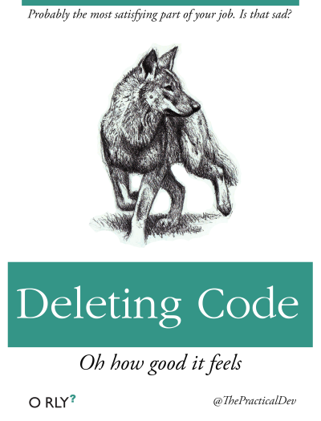

<!-- README.md is generated from README.Rmd. Please edit that file -->
Full Resolution O Rly Book Covers
=================================

Full resolution images of the O RLY book covers made by [The Practical Dev](http://twitter.com/thepracticaldev)

These are parody images and are not associated with the actual [O'Reilly Media](http://www.oreilly.com/) company or brand.

Here is the [O RLY Cover Generator](http://dev.to/rly).

These images can be used for non-commercial purposes under the [Attribution-NonCommercial 2.0 Generic](https://creativecommons.org/licenses/by-nc/2.0/)

Gallery of the O Rly Book Covers
================================

Clickable gallery, which is created from a small chunk of R code in an executable R Markdown [`README.Rmd`](README.Rmd). [This gist](https://gist.github.com/jennybc/0239f65633e09df7e5f4) shows similar syntax but with markdown image links, instead of html.

                                                               
